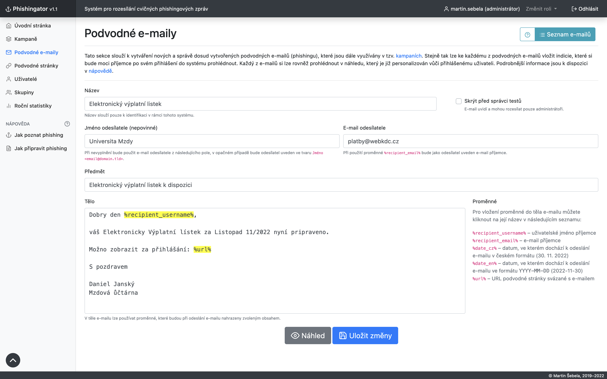
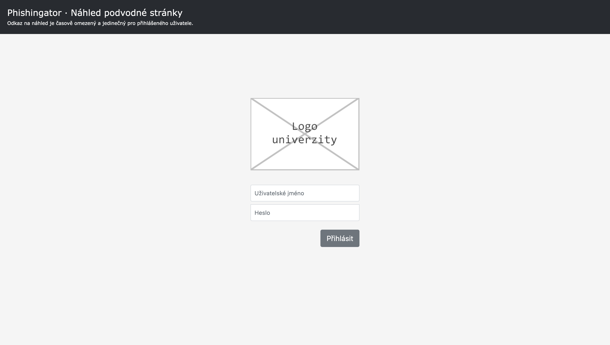
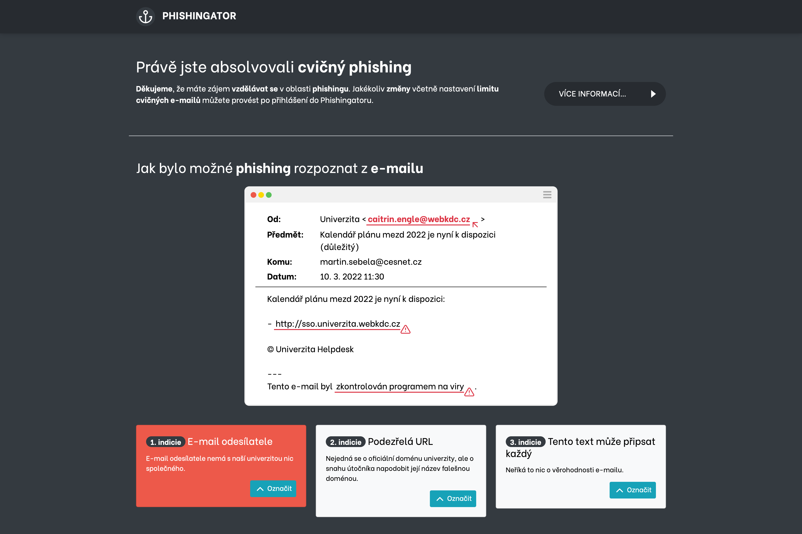

# Phishingator – Screenshoty aplikace

U jednotlivých screenshotů z Phishingatoru je vždy uveden krátký popis.

## 1. Vytváření podvodného e-mailu

Ve Phishingatoru se cvičné podvodné e-maily vytvářejí podobně jako v e-mailovém klientovi – tj. stačí vyplnit **jméno odesílatele**, jeho **e-mail** a samozřejmě **obsah zasílané zprávy**.

Cvičný phishing lze navíc **personalizovat vůči konkrétnému příjemci**, a to díky proměnným (na screenshotu vyznačeny žlutým podbarvením), které budou při odeslání e-mailu nahrazeny skutečným obsahem (např. uživatel jméno příjemce, e-mail, ...).

K takto vytvořenému e-mailu se následně přidávají tzv. **indicie**, na základě kterých bylo možné podvodné jednání (phishing) rozpoznat. Indicie (resp. označené pasáže v obsahu e-mailu) jsou vidět na screenshotu č. 5.

## 2. Vytváření podvodné stránky

S podvodným e-mailem je spjata podvodná stránka, která se snaží příjemce přimět k vyplnění přihlašovacích údajů.

Do Phishingatoru lze vkládat **libovolné šablony podvodných stránek** (jednoduché HTML a CSS) a poté pouze upravit **DNS u (sub)domény**, která bude sloužit jako hostitel cvičné podvodné stránky.

## 3. Statistika kampaně

Cvičný podvodný e-mail a cvičná podvodná stránka je pak součástí tzv. **phishingové kampaně**, která je určena **konkrétním příjemcům** a trvá po **stanovenou dobu**.

Po zahájení kampaně lze v **reálném čase sledovat**, jak užívatelé na cvičný phishing, potažmo podvodnou stránku **reagují** a zdali do formuláře na ni umístěné něco zadávají. **Zadané údaje** se obratem vyhodnocují (platnost přihlašovacích údajů vs. různé vzkazy pro útočníka apod.) a **promítají do grafů a tabulek**. 

## 4. Statistika kampaně – reakce uživatelů

**Akce na podvodné stránce** včetně zadaných údajů, které provedli jednolitví příjemci, lze rovněž sledovat v statistikách phishingové kampaně.

## 5. Zpětná vazba pro uživatele

Pokud příjemce cvičného phishingového e-mailu cokoliv vyplní do formuláře na podvodné stránce, je obratem přesměrován na **vzdělávací stránku** s původně odeslaným e-mailem a **indiciemi**, na základě kterých bylo možné phishing rozpoznat.

Uživatel je tak **nenásilně poučen**, jakým způsobem bylo možné phishing rozpoznat tak, aby příště podobnému pokusu (například tomu skutečnému) **nepodlehl**.

