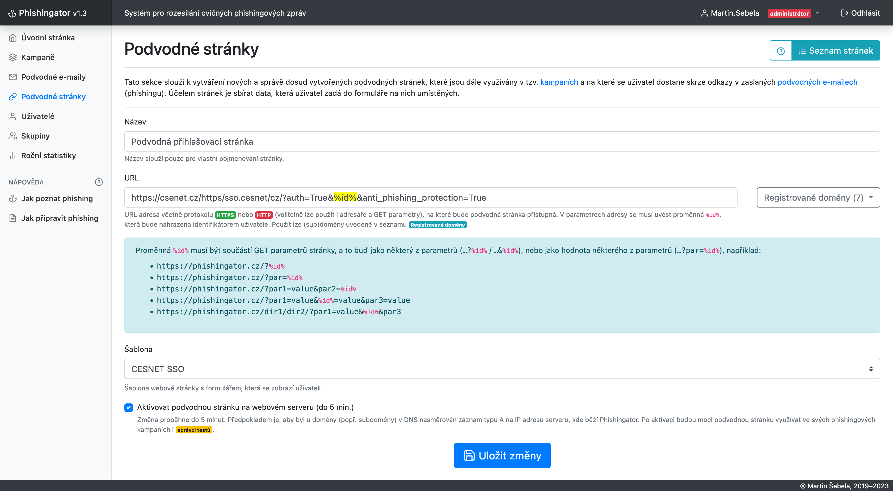

# Phishingator – Ukázkové screenshoty

Následující screenshoty z Phishingatoru zobrazují **proces tvorby phishingové kampaně** od vytvoření cvičného podvodného e-mailu až po sledování reakcí příjemců včetně poskytnutí zpětné vazby uživatelům. U screenshotů je vždy uveden krátký popisek.

## 1. Vytvoření podvodného e-mailu

Ve Phishingatoru se cvičné podvodné e-maily vytvářejí podobně jako v e-mailovém klientovi – tj. stačí vyplnit **jméno odesílatele**, jeho **e-mail** a samozřejmě **obsah zasílané zprávy**.

Phishingový e-mail lze navíc **personalizovat vůči konkrétnímu adresátovi**, a to použitím proměnných (na screenshotu vyznačeny žlutým podbarvením), které budou při odeslání e-mailu nahrazeny skutečným obsahem – například jménem a příjmením příjemce, jeho uživatelským jménem nebo třeba e-mailovou adresou.

## 2. Přidání indicií k podvodnému e-mailu

K vytvořenému podvodnému e-mailu se následně přidávají tzv. **indicie**, na základě kterých bylo možné phishing rozpoznat. Indicie (resp. podezřelé pasáže označené v obsahu e-mailu) jsou uživateli obratem zobrazeny při **podlehnutí phishingu**, případně **po ukončení phishingové kampaně**, a to formou vzdělávací stránky (viz [screenshot č. 7](#7-vzdělávací-stránka--zpětná-vazba-pro-uživatele)).

## 3. Vytvoření podvodné stránky

S podvodným e-mailem je spjata podvodná stránka, která se snaží příjemce přimět k vyplnění přihlašovacích údajů. Do Phishingatoru lze vkládat **libovolné šablony podvodných stránek** (tj. vzhled podvodné stránky v HTML, CSS a JavaScriptu) a poté pouze upravit **DNS u (sub)domény**, která bude sloužit jako hostitel cvičné podvodné stránky. Samotná podvodná stránka pak může běžet na **libovolné URL adrese** – je tak možné používat fiktivní adresáře, různé GET parametry apod.

## 4. Vytvoření phishingové kampaně

Cvičný podvodný e-mail a cvičná podvodná stránka jsou pak součástí tzv. **phishingové kampaně**, která je určena **konkrétním příjemcům** a trvá po **stanovenou dobu**. Administrátor zároveň určuje, k jaké akci má dojít **při vyplnění a odeslání formuláře** na podvodné stránce (typicky k zobrazení [vzdělávací stránky](#7-vzdělávací-stránka--zpětná-vazba-pro-uživatele) s indiciemi, podle kterých bylo možné phishing rozpoznat).

Příjemce lze do phishingové kampaně přidat buď **manuálně** (tj. zadáním e-mailových adres), **importováním** z konkrétního souboru (TXT, CSV), případně **interaktivním výběrem** díky napojení na LDAP/AD.

## 5. Statistika kampaně

Po zahájení kampaně lze v **reálném čase sledovat** jak uživatelé na cvičný phishing, potažmo podvodnou stránku, **reagují**, a zdali do formuláře na ni umístěné něco zadávají. **Zadané údaje** se obratem ověřují vůči zvolené autentizační metodě (např. vůči LDAP/AD) a informace o návštěvě webu a vyplnění přihlašovacích údajů se **promítají do grafů a tabulek**.

## 6. Statistika kampaně – reakce uživatelů

**Akce na podvodné stránce**, které provedli jednotliví příjemci, lze rovněž sledovat ve statistikách phishingové kampaně.

## 7. Vzdělávací stránka – zpětná vazba pro uživatele

Pokud administrátor při vytváření kampaně povolil zobrazování vzdělávací stránky (výchozí volba) a příjemce cvičného phishingového e-mailu cokoliv vyplní do formuláře na podvodné stránce, je následně obratem přesměrován na **vzdělávací stránku** s původně odeslaným e-mailem a **indiciemi**, na základě kterých bylo možné phishing rozpoznat.

Uživatel je tak **nenásilně poučen**, jakým způsobem bylo možné phishing rozpoznat tak, aby příště podobnému pokusu (například tomu skutečnému) **nepodlehl**.

